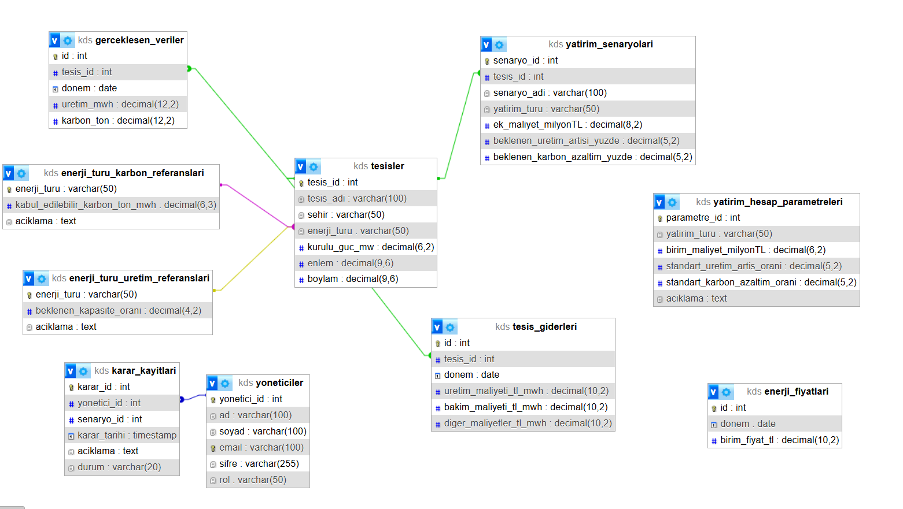

# Yeşil Strateji – Karar Destek Sistemi (KDS)

##  Proje Amacı
Bu projenin amacı; enerji üretim tesislerine ait veriler üzerinden yöneticilere
taktiksel karar desteği sunan bir web tabanlı karar destek sistemi geliştirmektir.

Proje kapsamında:
- Sunucu taraflı yazılım geliştirme,
- MVC mimarisinin doğru uygulanması,
- REST prensiplerine uygun API tasarımı,
- İş kuralları içeren senaryo analizleri
hedeflenmiştir.

## Mimari Yapı (MVC)

Proje katı biçimde **MVC (Model – View – Controller)** mimarisine uygun olarak geliştirilmiştir.

- **Controller**: HTTP isteklerini karşılar, response döner.
- **Service**: İş kuralları, hesaplamalar ve veritabanı işlemleri.
- **View**: EJS tabanlı arayüzler.
- **Route**: Endpoint tanımları.

Controller katmanı **hiçbir SQL sorgusu içermez**.

##  Sistem Modülleri

### 1️ Dashboard
- Toplam üretim, gelir, gider, kâr
- Karbon yoğunluğu
- Verimlilik ve performans grafikleri

### 2️ Senaryo Analizi
- Tesis bazlı yatırım senaryoları
- Üretim artışı, karbon azaltımı ve ROI hesaplamaları
- Yöneticiye karar desteği sağlayan analizler


##  İş Kuralları (Özel Senaryolar)

Projede zorunlu iş kuralları uygulanmıştır:

1. **Üretim artışı %100’ü aşamaz**
2. **Tesis seçilmeden senaryo analizi yapılamaz**
3. **Kayıtlı tesis yoksa sistem uyarı verir**
4. **Negatif getirili senaryolar silinemez**

## 🔁 CRUD İşlemleri

`yatirim_senaryolari` tablosu için tam CRUD desteği sağlanmıştır:

- **CREATE** → Yeni yatırım senaryosu ekleme
- **READ** → Senaryo ve tesis listeleme
- **UPDATE** → Mevcut senaryo güncelleme
- **DELETE** → İş kurallarıyla kontrollü silme

## 🔌 API Endpoint Listesi

### Dashboard
- `GET /api/kpi`
- `GET /api/trend/years`
- `GET /api/trend/uretim?year=YYYY`
- `GET /api/verimlilik`
- `GET /api/karbon-yogunluk`
- `GET /api/performans-matrisi`

### Senaryo
- `GET /api/senaryo/tesisler`
- `GET /api/senaryo/analiz?tesis_id=ID`
- `POST /api/senaryo`
- `PUT /api/senaryo/:id`
- `DELETE /api/senaryo/:id`
- `GET /api/senaryo/`


## 🧩 Veritabanı (ER Diyagramı)

Proje MySQL veritabanı kullanmaktadır.

**Temel tablolar:**
- tesisler
- gerceklesen_veriler
- enerji_fiyatlari
- tesis_giderleri
- yatirim_senaryolari

## ER Diyagramı

Aşağıda projede kullanılan veritabanı tasarımını gösteren ER diyagramı yer almaktadır:




##  Kurulum Adımları
```bash
git clone https://github.com/buseerturk/yesil_strateji_kds_projem.git
cd kds_projem
npm install

Projede yapılandırma bilgileri `.env` dosyası ile yönetilmektedir.
Güvenlik sebebiyle `.env` dosyası .gitignore içindedir ve .env.example dosyasıyla örnek gösterilmektedir.
EJS, backend tarafında hazırlanan verileri HTML sayfalarına
dinamik olarak aktarmak için kullandığım bir şablon  yapısıdır.
Bu yüzden EJS dosyalarının içinde HTML yapısı bulunur ve sayfanın tasarımı
için CSS dosyaları ile bağlantı kurulmuştur.
